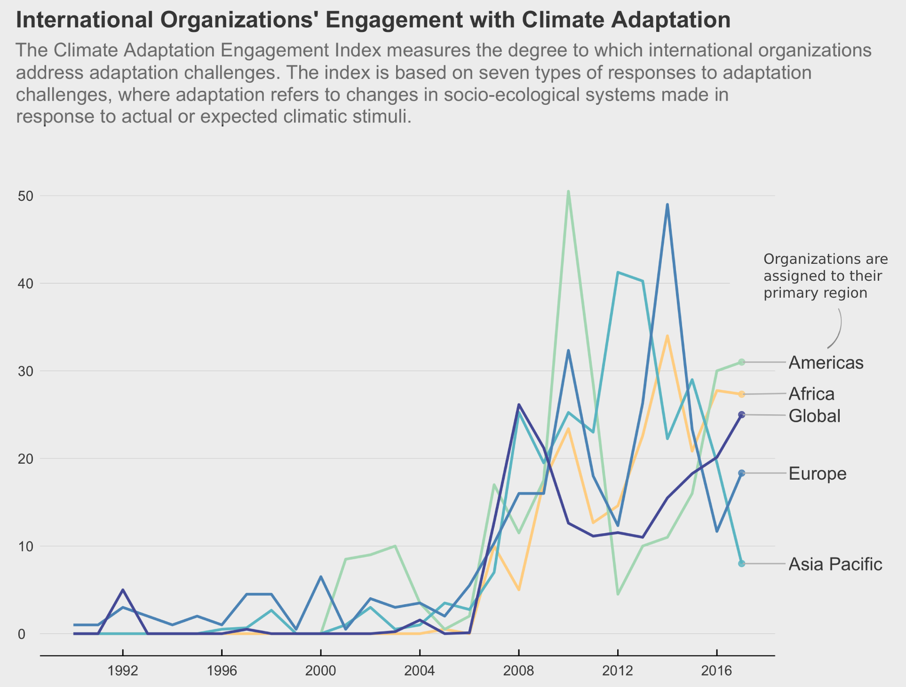
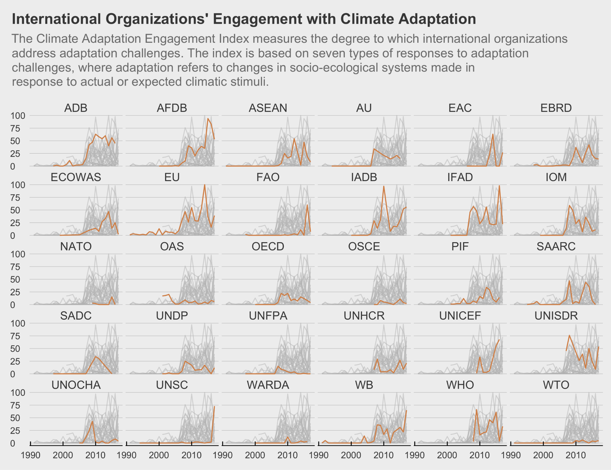
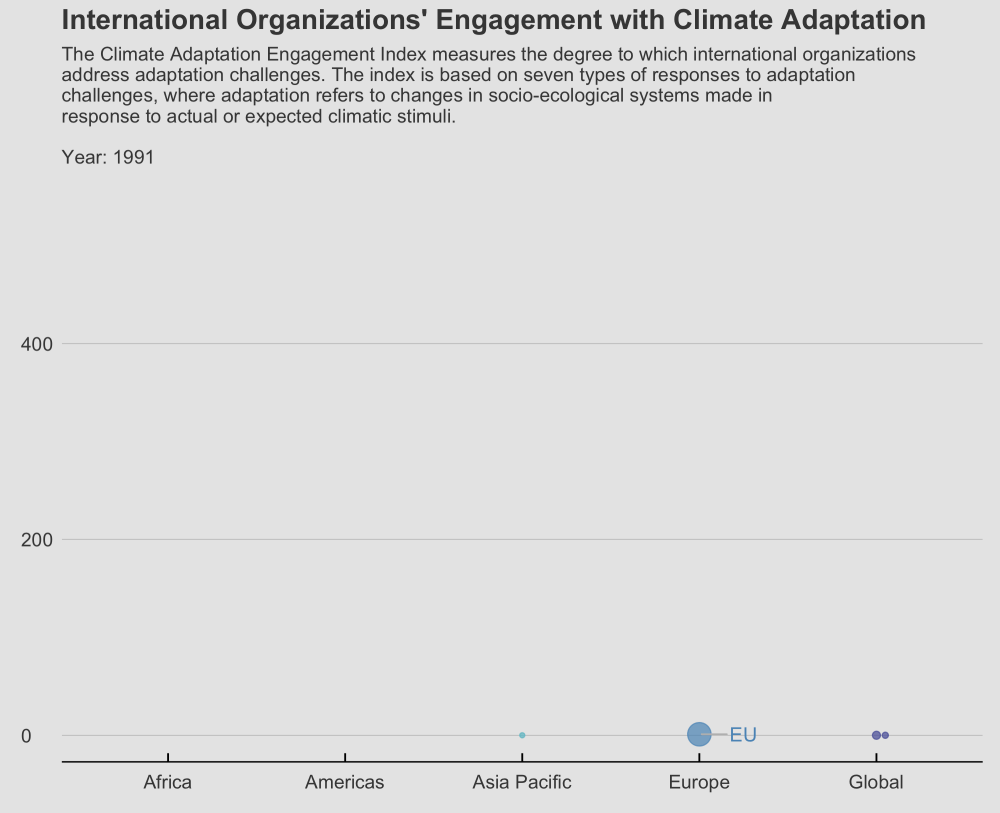
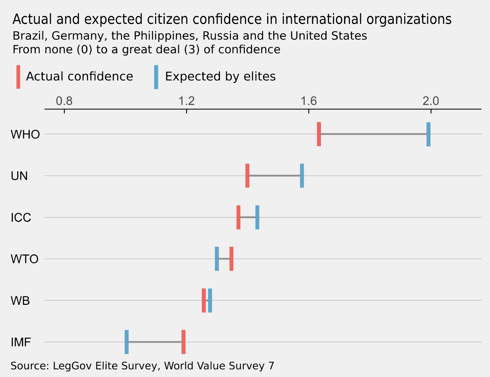
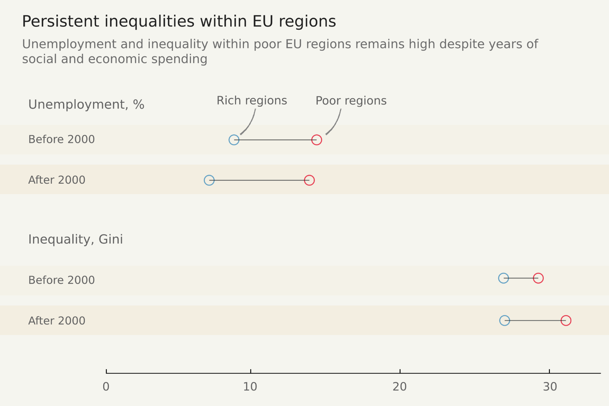

+++
author = "David Fornborg"
title = "Data visualizations of 2021"
date = "2022-04-05"
description = "In 2021 I joined the research project GlocalClim as a research assistant. One of my tasks was to explore and visualize some of the datasets that were being generated for papers and theses within the scope of this project."

categories = [

]
series = ["Themes Guide"]
aliases = ["migrate-from-jekyl"]
image = "CCA_line_header.png"
+++

While initially hesitant, owing to a sense that I would rather be involved in actual research, visualizing data turned out to be a creative outlet in the midst of other more theoretical work. 

All visualizations were made in R with ggplot2.

## Climate adaption 

This simple line graph of aggregated values by region was complemented by a facet of all organizations, maintaning some overview and comparability while displaying a lot of data in one visualization.

Finally I tapped into the animated graph craze with a gif. I didn't managed to iron out all the kinks before time was better invested in other projects.

## Legitimacy gap

I was asked to coauthor a background paper with Assoc. Prof. Lisa Dellmuth on the gap in legitimacy beliefs (trust) between citizens and elites towards international organizations. The main research was already done but in order to tailor the paper for the UN Stockholm50+ conference, I got to work with the underlying data in order to analyze it along cross sections that were more relevant to this context. 

Along the way I made a few simple visualizations thematically close to those found in The Economist. 

## Other

It's challenging to communicate findings from panel data, along a uniform y or x-scale. Here I used a dot plot and averaged the values with the year 2000 as a divider. This was for book project by Lisa Dellmuth on inequalities within EU regions. 