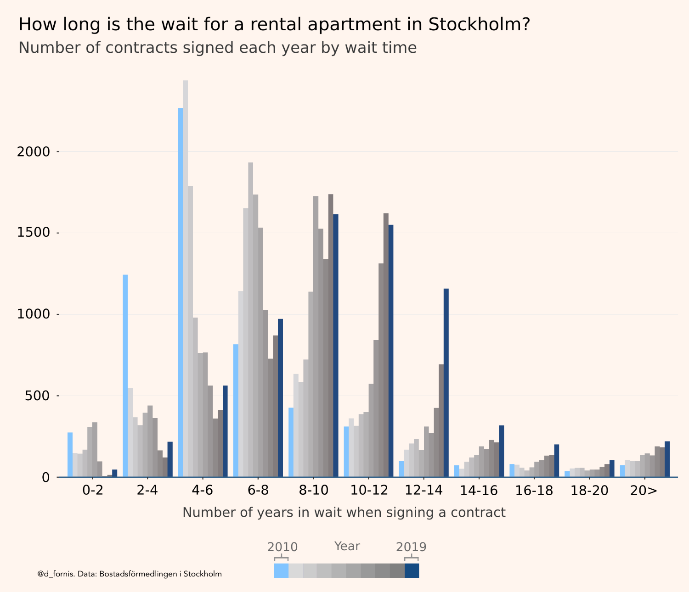

+++
author = "David Fornborg"
title = "Visualizing the Stockholm rental market"
date = "2022-09-12"
description = "20,000 politically interested swedes clicked on my rather dry-looking plot. It tells the story of a rapidly deteriorating market for rental apartments."

series = ["Themes Guide"]
aliases = ["migrate-from-jekyl"]
image = "bostadsmarknad_en_bw.png"
+++

### Background
How long is the wait for a rental apartment in Stockholm? It's an engaging question in the spotlight of both politics and daily life in the Swedish capital. In light of a recent surge in news articles about how young swedes struggle to enter the housing market, I took a look at data provided by Stockholms Bostadskö - Stockholm's sole distributor of rental apartments. It tells a story about a deteriorating rental market with a rapidly growing wait time for apartments (Swedes queue for apartments: Soviet style). I recently found the time to send them an email and request data going back 10 years.

### The plot

Visualizing the data, I was struck by how the distribution of the number of years people wait for their apartments has shifted to the right. In another thread on this forum, a contributor had suggested that anecdotal experiences of longer wait times are imagined. "It has always been like this and every generation rediscovers the dysfunctional nature of the rental market," his or her sentiment echoed. Looking at the data, I knew that this wasn't true: there had been a dramatic shift for the worse in less than ten years. I use a bar plot to capture this change, colorizing the years of 2010 and 2019 to emphasize the shift. I also want to provide viewers with data for the intermittent years. Shown in a gray scale, the intermittent bars don't obfuscate the two colorized distributions and provide more information to curious viewers.

### Delivery
As is often the case in a different subreddit, r/dataisbeautiful, a visualization can garner an audience by itself if it's a map or if it's an animated plot. My experience however is that a more technical plot ideally should be accompanied by a story or a striking fact. To this effect, the title of my post contains information that is deducible from the plot but not immediately available from looking at it. The title of my post states that, "In 2010 65% of applicants attained their rental apartment within 6 years of waiting. In 2019, this number had fallen to 11.7%." This is a striking way to describe the cumulative distributional shift with data that is available in the visualization. It's releatable, considering that Swedes think of six years as a reasonable time to wait for an apartment, and it instructs the viewer of what kind of information one can obtain from looking at the plot. 

20,000 might not make the bar for going viral on Tik Tok. But these are 20,000 politically interested Swedish members of a subreddit. Why did this plot strike a chord with its users? A pattern emerges from surveying the topics  that tend to garner upvotes and comments from visitors to this subreddit. Inflation, electricity prices, the housing market, corruption, petty crime such as theft, and growing inequality are topics that garner the most attention. They are political and topical while simultaneously impacting the quality of life of its users. Dysfunctional housing and rental markets are issues that many westerners find themselves navigating as young adults. It affects their quality of life in a tangible and often negative way. Data, effectively communicated, that affirm the personal experience of not being able to attain a rental apartment, is engaging. A plot that describes this reality is not only saying: "please worry about this", but it also affirms the lived experience of the viewer. 

### Summary
To summarize, these are ingredients that I believe helps a more technical plot garner a large audience:
* Data that connects with the viewer on a personal level.
* Data that confirms (or contradicts (both are probably engaging)) the lived experience.
* Data that signals that someone's status should decrease (politicians in this case) or increase. This is a Tyler Cowen-esque speculation.
* Effectively communicates a shift in time or a discrepancy between groups.
* Delivered with a story or a striking fact that is deducible from the visualized data.

