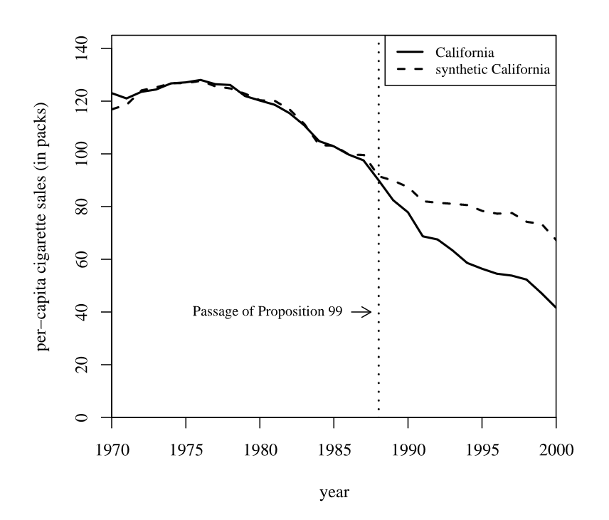
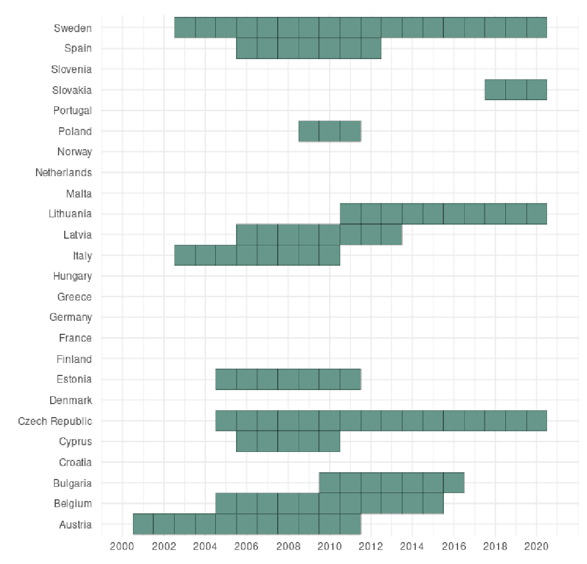
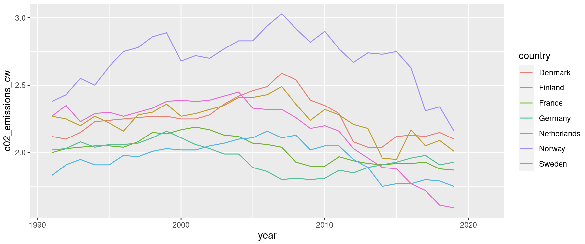
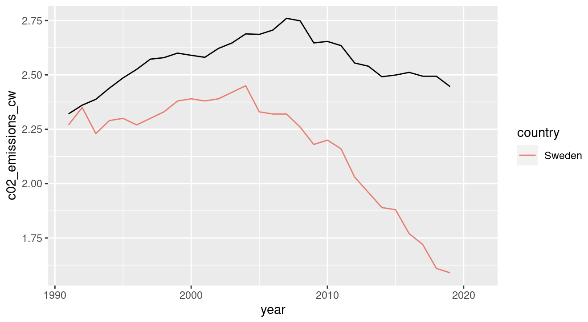
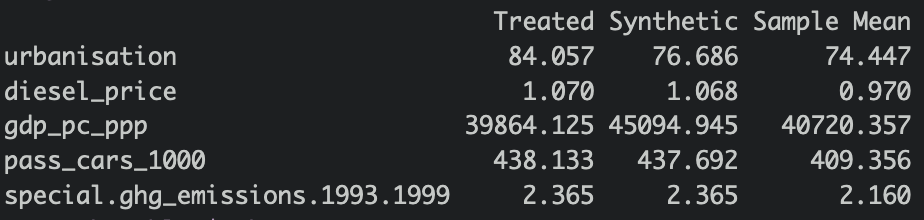
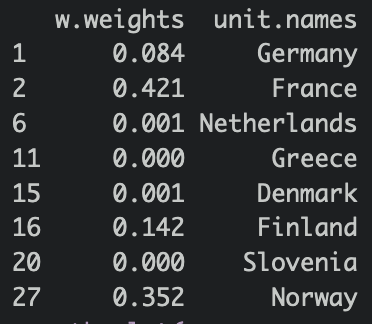
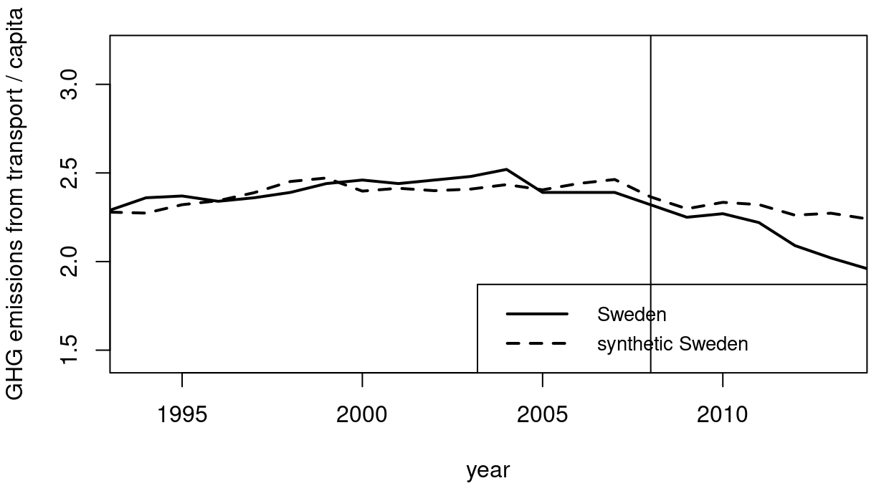

+++
author = "David Fornborg"
title = "Ex-post policy evaluation with the synthethic control method"
date = "2023-06-14"
description = "The European Commission has asked Sweden to evaluate its excise tax exemption for biofuels. Here, I show the research plan we suggested, and test it empirically with a counterfactual method on observational data."

series = ["Themes Guide"]
aliases = ["migrate-from-jekyl"]
image = "background.png"
+++
s
### Introduction
Randomly assigned controlled experiments are, naturally, a favored tool by scientists who want to make claims about causality in research. They are however expensive, impractical and often ethically dubious to run in a social science or policy context. Consider the country that randomly assigns its regions into a treatment and control group when implementing criminal justice reform, in order to find out if it has the intended effect, all else equal. Such an exercise would result in a few excited scientists and a lot of angry citizens. Until recently, quantitative social scientists made do with running simple OLS regressions on observational data - reporting correlations as the primary result. This has changed for with the introduction of a set of methods that help researchers identify random assignment of treatment in existing data that, with a bit of creativity, makes it possible to construct artificial treatment and control groups without running an actual experiment. 

Collectively, the introduction of these models has resulted in what has been dubbed a 'credibility revolution' in economics, and a shared Nobel prize. Guido Imbens, one of the main forces behind these methods, has described a late comer to the group - the synthethic control method - as “arguably the most important innovation in the policy evaluation literature in the last 15 years” (Athey & Imbens, 2017). In this text, I will provide a practical example of how this method can be applied on a real and current policy case from the energy policy sector. The text is concise write up of the evaluation plan I helped develop for Sweden's evaluation of its excise tax exemption for high-blended biofuels, as requested by the European Commission. It also provides an implementation on actual data with preliminary results. 

### The synthethic control method
The method was developed in a series of papers (Abadie and Gardeazabal 2003, and Abadie, Diamond and Hainmueller 2010) and has become an established method for policy evaluations in case studies with one treated unit. Its first policy application was on proposition 99 - an increase of the excise tax on tobacco products in California - by testing its impact on smoking.  Politics are not designed around the conditions of randomly controlled trials, meaning that there were no "control California" available that didn't get the treatment while also sharing California's other characteristics. As such, there was no obvious way to estimate the effect of the legislation, all else equal. The synthetic control method solves this rather elegantly. It offers an algorithmic approach to constructing control groups. For the unit that receives treatment, the control is a weighted average of the untreated units that best predicts the outcome variable in the pre-treatment period for the treated unit. In the post-treatment period, it provides a synthetic counterfactual for the treated unit. In the case of tobacco legislation, the synthetic control weighs the predictors of smoking (drinking, demographic variables, etc.) from a panel dataset of states, and creates a synthetic control from donor states that best match the rate of smoking of California, for the years that precede the excise tax change. 

After the policy intervention (post-treatment), the rate of smoking is allowed to deviate, given that there is an effect. The difference between the rate of smoking in actual California and the synthetic California, in the post-treatment period, is the estimated effect of an excise tax increase on smoking. 

### The case of Sweden's excise tax exemption
Sweden introduced an excise tax exemption for high-blended and pure biofuels in two steps, first by removing the energy tax in 2003 and then the carbon tax in 2008. High-blended biofuels include bioethanol based fuels such as E85 and bio/synthethic diesels such as FAME and HVO. The price at pump is often higher for these fuels than their fossil equivelants, even without excise taxes. This limits the impact on fuels used in the passenger fleet, but is enough to incentivize transport and public transit companies into switching by providing them with the value of environmental signaling and ability to meet carbon emission targets. Ultimately, the goal of incentivizing biofuel use is to reduce carbon emissions from transport.

### Preparations
So how should we go about constructing the synthetic control? First, we need to know what countries, in the EU, that are untreated, i.e. had no excise tax exemption in place, during the studied period.

I did a binary coding of EU country's excise tax policies instructed by state aid case documents in the European Commission's state aid database. This provided us with a set of untreated countries, that can be used as donors for the synthetic control. Now, the model needs data on predictors for, in this case, carbon emissions from transport per capita as well as the actual outcome variable in order to estimate its weights. We were instructed in choosing predictor variables by Andersson (2019) who uses a synthetic control model to estimate the effect of the original introduction of a carbon tax on transport fuels in 1990. The actual data on predictors was obtained from The World Bank database, and for the outcome variable, we obtained panel data for a large selection of countries for  1990 through 2019 from the Climate Watch carbon emissions database. 
First, let's consider what would happen if we used the average of carbon emissions from transport from relevant countries as a control group, without weights. 

It's clear that other, but not all, countries in this group experienced falling carbon emissions from transport in the late 2000's and on. A simple explanation is that all countries follow the EU Renewable Energy Directive and similar directives that preceded it with biofuel targets for the transport sectors, pursuing different policy tools for this purpose. Some applied obligatory blending quotas for biofuels in gasoline and diesel. The discrepancy is quiet large, both in absolute terms and in rate of change. It seems like there are confounding factors that muddle our ability to single out the effect of a single policy intervention, such as an excise tax change. Further, underlying factors such as road networks, GDP, fuel taxes and more are making it hard to find a suitable control country, similar to Sweden but without the excise tax change, and with all else equal. Using the average co2 emissions from transport of all countries, as a control, wouldn't help control for confounders.

But what if, instead of an average, we could estimate weights for these countries, as determined by outcome and predictor variables, in order to create a synthetic control with a better fit. Having the lines fit, in the pre-treatment period, would indicate that both observed and unobserved confounding variables are controlled for. 

### Estimating the weights
The synthetic control is constructed by optimizing two set of weights. It's an optimization problem that seeks to minimize the sum of the absolute differences between the outcome variable for the treated unit (Sweden) and the donor countries. 

The first component is a vector of the average of the predictor variables for the treated unit over the pre-intervention period given by:
$(X1 = (1/T0) * Σ_{t=1}^{T0} x1(t))$

The second component is a matrix of the average of the predictor variables for each potential control unit over the pre-intervention period given by:
$(X1 = (1/T0) * Σ_{t=1}^{T0} x1(t))$

And the optimization problem can be defined as:
$(\min_W \quad || X_1 - X_0 W || \text{subject to } W \geq 0, \quad \sum_{j=1}^{J} W_j = 1)$

Here, W is a vector of weights for the control units that minimizes the difference between the treated unit and the synthetic control unit in the pre-intervention period. Each weight in W corresponds to one control unit (one country in this case). The constraints that W ≥ 0 and Σ W = 1 ensure that the weights are non-negative and sum to 1.

The predictor variable weights are implicitly and recursively determined in this process, so as to minimize the difference between the outcome variable for Sweden and the synthetic control.

Here are the predictor values that I obtained:

We can see that it optimized for a close match between Sweden (Treated) and the synthetic control in terms of diesel price, passenger cars per 1000 inhabitants and previous carbon emissions from transport, indicative of that these were strong predictors of the outcome variable.

In terms of country weights, I obtained the following:

The algorithm determined that France, Finland and Norway were the most suitable donor countries.

### Results
After the synthetic control is constructed, we compare the outcome variable for the treated unit and the synthetic control during the post-intervention period. Any difference between these two could be attributed to the treatment. Granted that the synthetic control has a good fit with the actual outcome for Sweden, chances are that it's a good counterfactual. 

In terms of fit, we went from the average of all countries:

to the weighted synthetic control:

We can see that the pre-treatment period provides a decent but not perfect fit, at least controlling for parts of the variation that stems from covariates such as GDP, diesel price, and passenger car density, as well as unobserved covariates. In the pst-treatment period, we observe a gradual divergence between the actual carbon emissions for Sweden and the synthetic control which provides us with a counterfactual scenario where Sweden did not implement an excise tax policy change.

