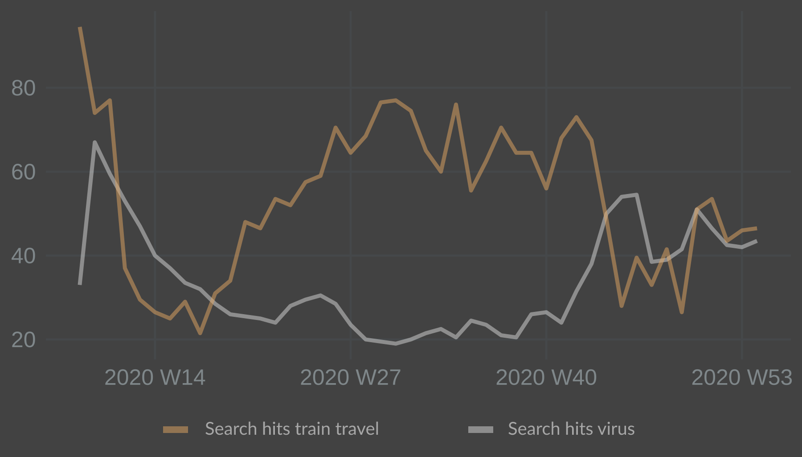
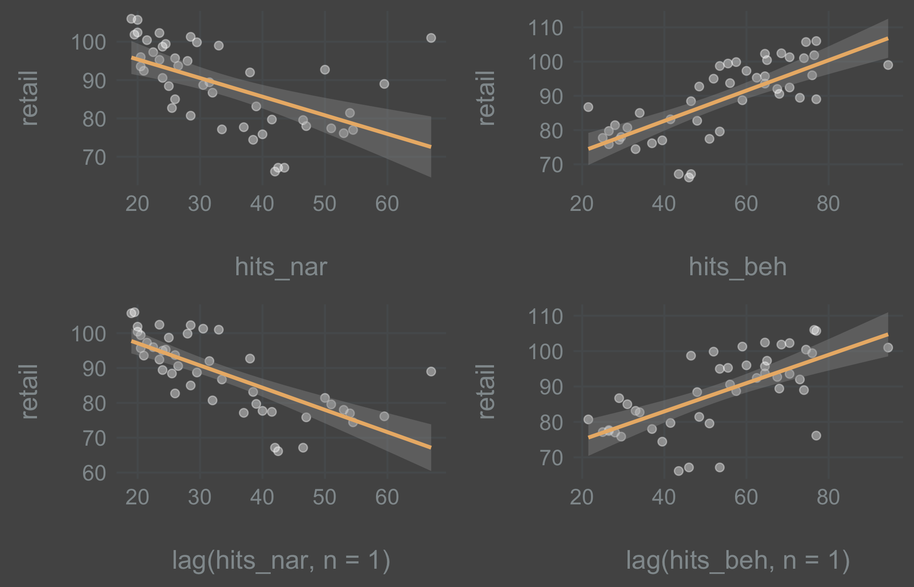
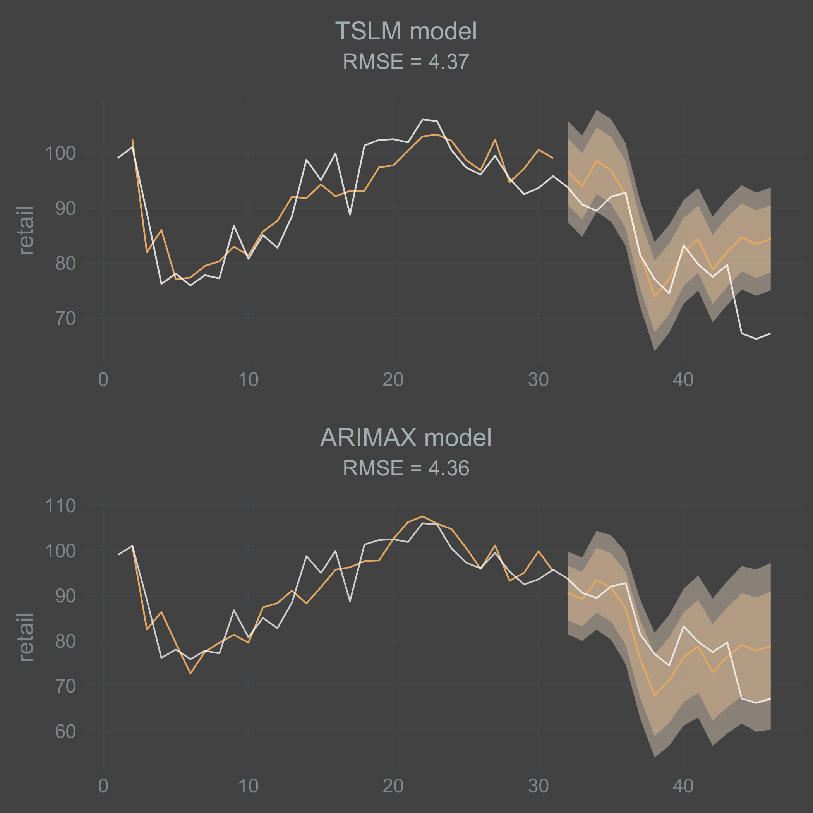
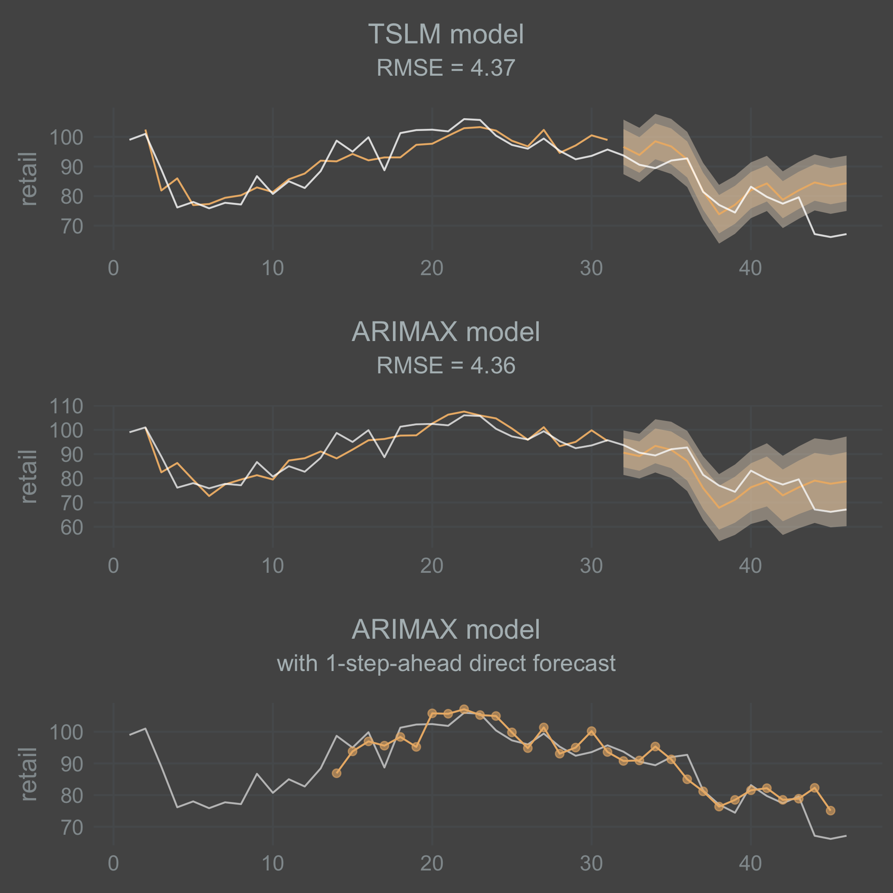

+++
author = "Hugo Authors"
title = "Predicting movement patterns with R"
date = "2021-01-31"
description = "The Covid-19 pandemic has rendered the standard tool set for making economic forecasts less effective. Can high frequency Google Trends data be used as an alternative input in forecasts in times of high uncertainty?"

tags = [
    "r",
    "narrative economics",
    "prediction",
    "gtrends",
]
categories = [

]
series = ["Themes Guide"]
aliases = ["migrate-from-jekyl"]
image = "nicolas-perondi--Ho_obgLFs4-unsplash.jpg"
+++

---

Economic forecasts have proven to be as unreliable as predictions on infection rates. Part of the difficulty lies in economic indicators being downstream from the development of the pandemic. Higher infection rates leads to lower mobility which leads to lower economic activity. Macroeconomic indicators are also collected with a  large enough lag to make them unusable for making the kinds of short time horizon forecasts that are valuable in times of high uncertainty.

My idea was to circumnavigate this issue by making 1-week-ahead forecasts of movement patterns with an ARIMAX model where Google Trends data supply leading indicators as external variables in the model. 

So what would be the utility of predicting changes in movement patterns? A sharp drop in movement can be categorized as a black swan event for affected parties, whether they are retail stores, public transport companies or government agencies. For public transport, even a 1-week-ahead forecast of a sharp drop or increase in commuting could be useful. And movement patterns is of course a kind of macroeconomic indicator in itself.

## Theory
The underlying theory has been advocated for as Narrative Economics by Robert Shiller. But it has featured as a theme in many works without being mentioned by name, such as in Galbraith's *The Great Crash of 1929* from 1955. Tracing its origins takes us back as far as the 1930's when Keynes coined the phrase animal spirits, meant to capture a characteristic of human behavior beyond what was imagined in the classical models of economics. 

The assumption is that economic outcomes, to some extent, are a function of the stories and ideas people spread. When these stories reach a wide and receptive audience they turn economic behavior into heard behavior.

## Data
To capture the narrative component I used an R library called ```gtrendsR``` which does the API call to Google Trends for you so you don't have to cURL it. The data however is a bit unreliable, in the sense that Google provides the amount of hits as an index which is calculated in a black box of unpredictable magic, as noted by Shiller in his 2019 book Narrative Economics (but not in those words).

My query in Google Trends was ```covid``` and ```virus```. In this case, as the word spreads about Covid-19, people go online to search for information which registers in the index from Google Trends. This variable is countercyclical and should be negatively correlated with movement patterns.

And then another variable that captures the behavioral change. For this variable my query was ```snälltåget``` and ```sj``` which are the main operators of long distance trains in Sweden. The assumption here is that people on average go online and search for train tickets 1 week ahead of departure. This variable is procyclical and should be positively correlated with movement patterns. 

For data on movement patterns I used Google Mobility Report, one of the most interesting publicly available data sets on the internet. It was launched in the infancy of the Covid-19 pandemic to track changes in movement patterns all over the globe. It calculates changes from the same days baseline categorized by country, sub region and type of location/activity (retail and recreation, parks, homes etc). 

## Model
One of the problems with applying a simple linear regression model is that time series data are likely to be autocorrelated which will show up in the residuals and violate important OLS assumptions. One way of resolving this is to model the residuals as an ARIMA-process. I ended up with a (1,1,0) process here. So the model used will be a linear regression with ARIMA errors. Sometimes referred to as ARIMAX, where the X denotes an external regressor.  

The equation is:  
$Y_t = B_1X_{1t} + B_2X_{2t} + n_t$ where $n_t = \phi n_{t-1} + \epsilon _t$ is the ARIMA error term. Notations for differencing are missing here.

In the model, narratives are spread at time t and have an effect on economic behavior at time t+1. Having input variables lagged at t+1 allows us to use external regressors as fresh input for 1-step-ahead prediction in an ARIMAX model.

## R code
Libraries:
```
library(tidyverse)
library(gtrendsR) # for Google Trends API calls.
library(fable) # tidyverse compatible replacement of the forecast package.
library(feasts)
library(tsibble)
library(lubridate) # to help with some weekly time series strangeness.
```

These were the inputs I went with for the Google Trends API call. 
```
query <- c("covid", "virus")
query2 <- c("snälltåget", "sj")
date <- c("2020-03-01 2021-01-15")
``` 
I wrote a function which loops along the query vectors and outputs the mean of hits (index of times searched) in a data frame. This way it's easy to experiment with different search queries and do some explorative data analysis.

```
search_se <- data.frame()

search_se_mean <- function(query) {
  for(i in seq_along(search)) {
    print(search[i])
    search_se <- rbind(covid_se,
                      gtrends(keyword = search[i],
                              geo = "SE",
                              time = date)[[1]])
  }

search_se_mean <- search_se %>%
  mutate(week = yearweek(date, week_start = 1)) %>%
  group_by(week) %>%
  summarise(hits = mean(hits))
}

gtrends_nar <- search_se_mean(query)
gtrends_beh <- search_se_mean(query2)

gtrends_se <- gtrends_nar %>%
  full_join(gtrends_beh, by = "week", suffix = c("_nar", "_beh"))
```

Let's plot them together. 



Hits for train travel drops sharply, as one would expect, and then rebounds over the summer. Hits for the virus jumps up but starts dropping surprisingly fast. Lower levels over the summer is in line with lower spread. Come autumn and the index jumps up again. This inverse relationship between narrative and behavioral predictors make intuitive sense and looks promising.


Next up was seeing how the predictors match with what I was trying to predict: movement patterns.

The movement data is available at https://www.google.com/covid19/mobility/ I went with the .csv-file for global data and did the filtering in R.
Once it's loaded, the following code will filter for the target country with ```country_region_code```. I filtered for ```sub_region_1 = "" ``` in order to capture data for all of Sweden. The data is then transformed into weeks. Note that I used the variable ```retail_and_recreation_percent_change_from_baseline```.

``` 
gmr_se <- gmr %>%
  mutate(date = as_date(date)) %>%
  filter(country_region_code == "SE",
         sub_region_1 == "",
         date >= "2020-03-01" & date <= "2021-01-17") %>%
  select(date, retail_and_recreation_percent_change_from_baseline) %>%
  mutate(week = yearweek(date, week_start = 1)) %>%
  group_by(week) %>%
  summarise(across(everything(), list(mean))) %>%
  rename(
    "retail" = retail_and_recreation_percent_change_from_baseline_1) %>%
  select(week, retail)

df_se <- gtrends_se %>% # join data sets together
  left_join(gmr_se)

df_se$retail <- df_se$retail + 100 # for potential differencing and log transformations
``` 

Regressions and scatter plots:

I inspected the relationship between y, x1 and x2 while running regressions with and without lag at the same time. Inspecting the plots we see that there is a linear relationship between the variables. The narrative (virus search) variable does well with 1 lag, while the behavioral (train ticket search) does better without a lag. But this will depend a lot on the search queries used and on the reliability of Google's black box of magic. So for this experiment I stuck with the theory in order to be able to predict 1-step-ahead. Lagged variables it is.

Next, preparing the data for model fitting.
```
val_weeks <- 15 #15 weeks for validating the models

df_se_index <- df_se %>%
  mutate(index = seq_along(1:nrow(.)),
    type = if_else(index > max(index) - val_weeks,
    "validation", "training"),
    hits_nar_lag = lag(hits_nar),
    hits_beh_lag = lag(hits_beh))

tsibble_se <- as_tsibble(df_se_index, index = index) # as time series tibble

tsibble_se_train <- tsibble_se %>%
  filter(type == "training")

tsibble_se_val <- tsibble_se %>%
  filter(type == "validation")
```

Here I'm computing bot hthe TSLM and the ARIMAX (1,1,0) model to see if it makes sense to model the residuals as an ARIMA-process.

```
fit_tslm <- tsibble_se_train %>% # fit the model on the training data
  model(TSLM(retail ~ hits_nar_lag + hits_beh_lag))

fc_tslm <- fit_tslm %>% # forecast with the validation data
  forecast(new_data = tsibble_se_val)

fit_arimax <- tsibble_se_train %>%
  model(ARIMA(retail ~ hits_nar_lag + hits_beh_lag + pdq(1, 1, 0)))

fc_arimax <- fit_arimax %>%
  forecast(new_data = tsibble_se_val)

rmse_tslm <- round(accuracy(fit_tslm)[, 4], digits = 2) # extract RMSE

rmse_arimax <- round(accuracy(fit_arimax)[, 4], digits = 2) # extract RMSE

fit_tslm %>% gg_tsresiduals() 
```

The patterns at index > 18 or so didn't look like a white noise-process to me. This shows up in the ACF plot as well, even though the spikes aren't significant. This will depend a lot on the data retrieved from Google Trends.  
Fitting the ARIMAX-model:


Evaluating the model, it looked more like a stationary white noise process. No significant spikes.


For plotting models and forecasts produced with Fable, I went with this:
```
tslm_plot <- 
  tsibble_se %>%
  mutate(color = if_else(type == "training", "#7e828c", "#7e828c")) %>%
  ggplot(aes(x = index, y = retail)) +
  geom_line() +
  autolayer(fc_tslm, alpha = 0.5, color = "#aa332c") +
  geom_line(aes(color = color), alpha = 0.8) +
  geom_line(aes(y = .fitted, color = "#aa332c"), data = augment(fit_tslm)) +
  labs(
    title = "TSLM model",
    subtitle = paste0("RMSE = ", rmse_tslm)) +
  scale_color_identity() 
  
arimax_plot <- 
  tsibble_se %>%
  mutate(color = if_else(type == "training", "#7e828c", "#7e828c")) %>%
  ggplot(aes(x = index, y = retail)) +
  geom_line() +
  autolayer(fc_arimax, alpha = 0.5, color = "#aa332c") +
  geom_line(aes(color = color), alpha = 0.8) +
  geom_line(aes(y = .fitted, color = "#aa332c"), data = augment(fit_arimax)) +
  labs(
    title = "ARIMAX model",
    subtitle = paste0("RMSE = ", rmse_arimax)) +
  scale_color_identity() 
  
grid.arrange(tslm_plot, arimax_plot, nrow = 2)
```


I'm a bit surprised that the fitted TSLM model performed in parity with the ARIMAX model. I think this might vary a lot depending on the data you end up with. Both models do a decent job on the training data. But they both do a poor job at forecasting the sharp drop in movement that occurs at the end of the time series. I should point out that the ARIMAX model is forecasting the AR(1)-process recursively here, which means that there is a mean reversion where it looses its effect over time. 

Since I'm interested in the 1-step-ahead forecast, I wrote the loop below to capture what that looks like on the validation data. I hope and think that's what I did at least! The point here is to capture the direct 1-step-ahead forecast instead of a recursive forecast. 

```
tsibble_se_loop <- data.frame()
direct_pred <- data.frame()
index <- 15:nrow(tsibble_se)
val_weeks = 1

for(i in index) {
  tsibble_se_loop <- df_se %>%
    mutate(index = seq_along(1:nrow(.)),
           hits_nar_lag = lag(hits_nar),
           hits_beh_lag = lag(hits_beh)) %>%
    as_tsibble(., index = index) %>%
    filter(index < index[i]) %>%
    mutate(type = if_else(index > max(index) - val_weeks,
                          "validation", "training"))
  
  # Save the training data
  tibble_train_loop <- tsibble_se_loop %>%
    filter(type == "training")
  
  # Save the validation data
  tibble_val_loop <- tsibble_se_loop %>%
    filter(type == "validation")
  
  fit_arimax <- tibble_train_loop %>%
    model(ARIMA(retail ~ hits_nar_lag + hits_beh_lag + pdq(1, 1, 0)))
  fc_arimax <- fit_arimax %>%
    forecast(new_data = tibble_val_loop)
  
  fc_arimax <- as_tibble(fc_arimax) %>%
    select(index, .mean)
  
  direct_pred <- rbind(direct_pred, fc_arimax)
}

direct_pred <- as_tsibble(direct_pred, index = index)

arimax_direct_plot <- 
  tsibble_se %>%
  mutate(color = if_else(type == "training", "#7e828c", "#7e828c")) %>%
  ggplot(aes(x = index, y = retail)) +
  geom_line() +
  geom_point(aes(x = index, y = .mean), color = "#aa332c", fill = "#aa332c", size = 2, alpha = .8, data = direct_pred) +
  autolayer(direct_pred, alpha = 0.8, color = "#aa332c")  +
  labs(
    title = "ARIMAX model",
    subtitle = "with 1-step-ahead direct forecast") +
  scale_color_identity() +
  theme(
    axis.title.x = element_blank()
  )

grid.arrange(tslm_plot, arimax_plot, arimax_direct_plot,  nrow = 3)
```



It seems like the direct 1-step-ahead ARIMAX forecast does a little better than both the TSLM and the ARIMAX recursive forecast at self-correcting for the last drop off in movement. But still, it essentially fails to predict that last drop 1 week ahead. Leaving that aside, I'm a bit surprised at the level of predictive power in the model considering its simplicity. My take away from this experiment is that a leading narrative indicator gathered from Google Trends, or even better a social media platform, can be used to forecast outcomes in the real economy.