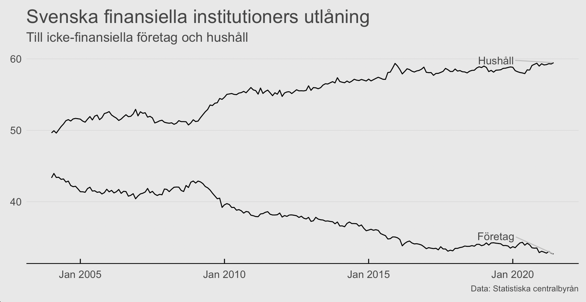
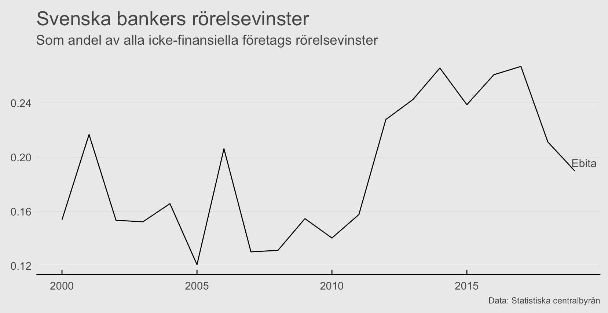
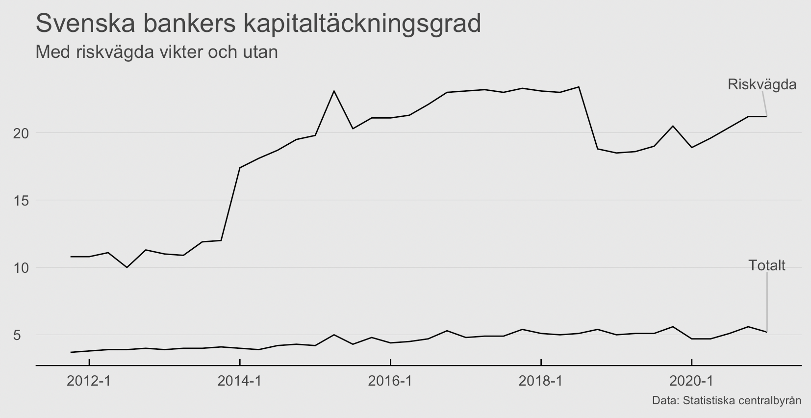

+++
author = "David Fornborg"
title = "Behövs de svenska storbankerna?"
date = "2021-01-31"
description = "De vanligaste berättelserna jag hör om de svenska storbankerna, och deras framtid, kan delas in i tre kategorier. Tre idéer om vilken roll de har och kommer att ha i framtiden. Om någon."

tags = [
    "r",
    "narrative economics",
    "prediction",
    "gtrends",
]
categories = [

]
series = ["Themes Guide"]
aliases = ["migrate-from-jekyl"]
image = "nicolas-perondi--Ho_obgLFs4-unsplash.jpg"
+++

---

Berättelserna är att:

1. Svenska banker är slimmade och välskötta företag. Deras centrala plats i ekonomin reflekteras i hälsosamma vinster, hög kundnöjdhet och god kapitaltäckningsgrad. De fyller en viktig roll i ekonomins kapitalförsörjning, en förutsättning för entreprenörskap och företagande. 
2. Svenska banker är krympande och förlegade institutioner som tillhör den gamla ekonomin. De ersätts allt mer av fintech-bolag, oberoende kapitalförvaltare, artificiell intelligens för effektivare låneprövning och e-kronor eller fristående tjänster för transaktionskonton.
3. Svenska banker har en oligpolliknande ställning på bostadsmarknaden. En ställning som de utnyttjar för att generera höga vinster. De lärdomar de inte drog av finanskrisen 2008 kunde ha stoppat framväxten av den bostadsbubbla som kommer att utlösa nästa finanskris.

Ett sätt att tänka på förändring är att se kriser som ett impetus för strukturella omvandlingar. Gamla strukturer tenderar att överleva bortom sitt bäst före-datum tack vare historisk spårbundenhet, det Douglass North kallade för path dependance, och befintligt momentum. Exempelvis så fanns teknologin på plats för att möjliggöra hemarbete för många arbetare redan innan Covid 19-pandemin. Pandemin blev den utlösande faktorn som blottade spårbundenheten i en arbetskultur som egentligen var förlegad. För ekonomin så innebär förändringen ett strukturellt skifte bort från transport och kontor till tech-företag som möjliggör distansarbete och bostäder. Mycket tyder på att de svenska storbankernas affärsmodell bygger på en liknande historisk spårbundenhet. Varför blev inte finanskrisen den utlösande faktorn som inledde en meningsfull strukturomvandling av den svenska banksektorn? Svenska storbanker är väldigt lönsamma. Men är det ett tecken på att de gör ett bra jobb, som i den första berättelsen, eller på en slags kollegialt oligopoliserad marknad för bostadslån, som i den tredje? 

## Berättelse 3
Den sista berättelse fick senast gehör av Andreas Cervenka och Carl Schlyter i podden Systemskiftet. De beskriver hur bankerna utnyttjar sin grindvaktsfunktion på bostadsmarknaden för att driva bostadspriserna högre varpå lånen blir större och fickorna med ränteslantar tyngre. Cervenka påstår att svenska banker har en kapitaltäckning för sina utestående lån på ca 5%. Det innebär en hävstång på 20 gånger. Otänkbart för de flesta företag och i strid med de internationella regleringarna i både Basel II och i det nya stramare Basel III. Stämmer det? Svart på vitt så stämmer det. Men den faktiska berättelsen är mer invecklad.

Peter Thiel har ett karaktäristiskt sätt att dela upp tillväxt på i två olika kategorier - globalisering och teknologi. Globalisering är en typ av horisontell tillväxt där existerande teknologier tillämpas på nya marknader medan teknologisk tillväxt är vertikal. Efter Soviets fall så stod de då nyligen liberaliserade baltiska ekonomierna utan ett eget hemväxt bankväsende. De stod därmed vidöppna för de opportunistiska svenska, och fläckvis danska, banker. I en horisontell rörelse som speglades på bred front på många andra håll i världen vid tiden - i Asien, Sydamerika och Indien - så flyttade de svenska storbankerna in. Det var inte bara handel som liberaliserades. Kapital kunde för första gången sedan 1914 strömma relativt fritt över nationsgränser. Växande ekonomier som de i Baltikum förväntas visserligen importera kapital. Men inte för att finansiera bostadsköp och konsumtion. Utan för att investera i fabriker som på sikt kan bidra till export och ett balanserat kapitalkonto. Balterna hade dessutom inga meningsfulla mängder pengar att stoppa in på sina nya svenska löne- och sparkonton. Utlåningen finansierades istället med kortfristiga lån på den internationella kapitalmarknaden med den svenska verksamheten som säkerhet. Att svenska banker finansierar sin utlåning på de globala kapitalmarknaderna var något som allmänheten, och sannolikt även många tjänstemän på berörda myndigheter, först blev varse om när SEBs och Swedbanks verksamheter i Baltikum imploderade lika snabbt som likviditeten på kapitalmarknaderna ströps under finanskrisens höst 2008. 

När vi tittar på svenska bankers verksamhet i Sverige idag så kan vi se en rörelse i den baltiska riktningen även här. Inlåningen är internationell och betoningen har skiftat bort från utlåning till företag och mot bostadsköpande hushåll. 

Det ger oss anledning att ifrågasätta berättelse 1 om de svenska bankernas roll som näringslivets kapitalförsörjare. Faktum är att om vi tittar på vilka som har investerat i några av svenskt näringslivs större och mer kapitalkrävande tillväxtbolag de senaste 10 åren, som Volvo AB, Volvo lastvagnar, Klarna, Spotify och Northvolt, så är svenska banker, oaktat några pensionsfonder, nästan helt frånvarande. I deras ställe finner vi kinesiska och tyska konkurrenter, amerikanska investeringsbanker och oberoende kapitalförvaltare. Svenskt kapital är istället till viss del uppbundet i den svenska bostadsmarknaden, som har varit en väldigt lönsam affär för de svenska bankerna.

## Low risk high reward
Ett sätt att mäta lönsamheten på är att titta på bankernas räntenetto. Det är skillnaden mellan vad bankerna betalar för att låna pengar, alltså för att finansiera utlåningen, och vad bankerna tar betalt i form av ränta på bostadslån. Ungefär 70% av finansieringen för ett bostadslån nås genom att bankerna emitterar obligationer på den internationella kapitalmarknaden, företrädesvis i EUR och USD. Finansinspektionen uppskattar räntenettot till att ha varit 1,44% under första kvartalet 2021.  Med en bolåneränta på kort löptid som ligger på ungefär detsamma så kan vi se att bankerna själva lånar i princip gratis. Att riskpremien för bankernas finansiering är så låg beror delvis på explicita och implicita garantier ifrån svenska myndigheter i händelse av kris. Sammantaget så är det en tacksam kalkyl att översatta till generösa vinster. Svenska bankers rörelseresultat som andel av alla svenska icke-finansiella företags rörelseresultat har legat på ca 24% sedan finanskrisen och sedan fallit ner till ca 20%. 

Berättelse 3, Cervenkas och Schlyters berättelse, är den om ett korrupt oligopol. Berättelse 2 är den om ett bankväsende som tillhör den gamla ekonomin som kommer att ersättas av vertikal tillväxt i nya teknologier. Om vi kombinerar de två berättelserna så kan vi ställa frågan: är det hållbart att en sektion av svenskt näringsliv genererar nästan 1/5 av övriga näringslivets vinster genom att agera som bostadsmarknaden grindvakter? Kan belöningen rimligtvis vara så stor för att slussa in globalt kapital på den svenska bostadsmarknaden i en process som mer eller mindre kan skötas av algoritmer? 

## En siffra är inte bara en siffra
För att komma vidare här så behöver vi förstå hur Cervenkas syn på bankernas kapitaltäckning skiljer sig från bankernas egen. Basel III fokuserar likt sin föregångare Basel II på riskvägda tillgångar. När Cervenka säger att bankerna har en kapitaltäckningsgrad på 5% så avser det tillgångarnas egentliga värde. Den globala standarden är dock att tillskriva vissa typer av tillgångar, som exempelvis ett lån med en bostad som underliggande säkerhet, en lägre riskvikt. Det innebär i teorin att en låneportfölj på SEK 100 miljarder smått magiskt kan återuppstå som en låneportfölj på SEK 50 miljarder. I samma slag sjunker kapitalkravet med hälften. I verkligheten kan skillnaden vara ännu mer dramatisk.

På ett sätt är det rimligt att ett lån med en underliggande säkerhet som en bostad inte ska behöva motsvaras av samma mängd kapital som ett lån utan en underliggande säkerhet. Den något genanta detaljen är dock att de svenska storbankerna har tillåtits tillämpa egna modeller för att räkna fram vilken riskvikt ett lån ska ha. Det är sannolikt därför ökningen i kapital som andel av just riskvägda tillgångar har kunnat vara så stor och volatil. Det är till viss del en pappersexercis som ligger bakom ökningen. Svenska storbanker har en historia av liknande metoder. Under det febrigt starka tillväxtåret 2006 så anade den estniska centralbanken oråd. Man höjde kapitaltäckningskravet från 8 till 10% och tillämpade en riskvikt på 100% för bostadslån. Svenska banker besvarade det nya kravet genom att flytta en typ av lågkvalitativt kapital från sina svenska verksamheter till sina estniska dotterbolag. De nya reglerna i Basel III minskar möjligheten för bankerna att luta sig mot den här typen av kapital.

Ett annat inslag i Basel III är att bankerna tvingas ha en så kallad likviditetsbuffert som ska fungera som en flytande krockkudde i händelse av att kapitalmarknaderna fryser till is som de gjorde hösten 2008. I praktiken innebär det att bankerna kommer tvingas att själva explicit bära mer av de kostnader som staten och skattebetalarna hittills har burit genom implicita och explicita löften till bankerna samt deras finansiärer och kunder i händelse av kris. Enkelt uttryckt så kommer bankerna att tvingas att betala mer av sin egen försäkringspremie. Om vi till det lägger amorteringskravet och finansinspektionens tendens att tillämpa ännu strängare regler, utanför Basel, så ser vi att det byråkratiska och politiska tålamodet med bankernas nuvarande affärsmodell har börjat tryta.

## En alternativ berättelse
När vi lägger pusslet såhär så framträder konturerna till en alternativ berättelse. De höga vinsterna beror nödvändigtvis inte på korruption och kartellbildning. Vi kan istället konstruera en alternativ beskrivning som bygger på en unik cocktail av billig global inlåning, drivet av statliga garantier, och höga inträdesbarriärer för aktörer som tillämpar nya teknologier.

Sammantaget bådar det illa för de svenska storbankerna. Den horisontella tillväxten i Baltikum hade kunnat bli ett par av storbankernas undergång om inte staten hade klivit in. Och den vertikala tillväxten har till  viss del uteblivit. Teknologi, att göra något nytt, är ett direkt hot mot deras dominerande ställning på bolånemarknaden. När något nytt kommer så lär det ske utanför storbankernas paraply. En marknad med så höga marginaler skapar starka incitament för outsiders. Det hänger till viss del på politiken och byråkratin att inte reglera bort konkurrensen. Sannolikheten för det minskar i takt med att det politiska och byråkratiska välviljan till status quo tryter.

Anledningen till att finanskrisen inte blev samma impetus till förändring för banksektorn som Covid 19-pandemin blev för hur vi arbetar - kan ha varit att teknologin och byråkratin inte var redo. Berättelse 2, där den nya ekonomin ersätter den gamla, kan förverkligas först nu. 

## Källor:
Basel Committee on Banking Supervision. (2013. Analysis of risk-weighted assets for credit risk in the banking book. 
[https://www.bis.org/publ6.pdf](https://www.bis.org/publ6.pdf)

Eesti Pank (2007). Financial Stability Review 1/2007. [https://www.eestipank.ee/en/publication/financial-stability-review/2007/financial-stability-review-12007](https://www.eestipank.ee/en/publication/financial-stability-review/2007/financial-stability-review-12007)

Finansinspektionen (2017). Baselöverenskommelse om bankers kapitaltäckning klar*.*

[https://www.fi.se/sv/publicerat/pressmeddelanden/2017/baseloverenskommelse-om-bankers-kapitaltackning-klar/](https://www.fi.se/sv/publicerat/pressmeddelanden/2017/baseloverenskommelse-om-bankers-kapitaltackning-klar/)

Riksbanken (2020). Storbankernas finansiering och dess påverkan på hushållens bolåneräntor. *Ekonomiska kommentarer)*

[https://www.riksbank.se/globalassets/media/rapporter/ekonomiska-kommentarer/svenska/2020/storbankernas-finansiering-och-dess-paverkan-pa-hushallens-bolanerantor.pdf](https://www.riksbank.se/globalassets/media/rapporter/ekonomiska-kommentarer/svenska/2020/storbankernas-finansiering-och-dess-paverkan-pa-hushallens-bolanerantor.pdf)

Riksbanken (2016). Penningpolitisk rapport 2016
[http://archive.riksbank.se/Documents/Rapporter/PPR/2016/160421/rap_ppr_ruta1_160421_sve.pdf](http://archive.riksbank.se/Documents/Rapporter/PPR/2016/160421/rap_ppr_ruta1_160421_sve.pdf)

SCBs finansmarknadsstatistik (2021)

SOU 2013:6. Att förebygga och hantera finansiella kriser: delbetänkande av Finanskriskommittén

Swedish Banker’s Association (2016). Cumulative impact of financial regulation in Sweden. Available at: [https://www.swedishbankers.se/media/2835/cumulative-impact-of-financial-regulation.pdf](https://www.swedishbankers.se/media/2835/cumulative-impact-of-financial-regulation.pdf).